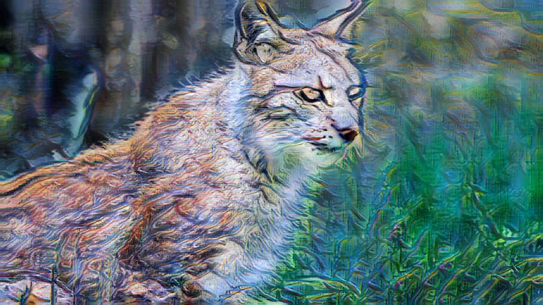

# ComfyUI-StyleTransferPlus
Advanced Non-Diffusion-based Style Transfer in ComfyUI

Click name to jump to workflow

1. [**Neural Neighbor**](#neural-neighbor). Paper: [Neural Neighbor Style Transfer](https://github.com/nkolkin13/NeuralNeighborStyleTransfer) 
2. [**CAST**](#cast). Paper: [Domain Enhanced Arbitrary Image Style Transfer via Contrastive Learning](https://github.com/zyxElsa/CAST_pytorch)
3. [**EFDM**](#efdm). Paper: [Exact Feature Distribution Matching for Arbitrary Style Transfer and Domain Generalization](https://github.com/YBZh/EFDM)
4. [**MicroAST**](#microast). Paper: [Towards Super-Fast Ultra-Resolution Arbitrary Style Transfer](https://github.com/EndyWon/MicroAST)

More will come soon

## Workflows

All nodes support batched input (i.e video) but is generally not recommended. One should generate 1 or 2 style frames (start and end), then use [ComfyUI-EbSynth](https://github.com/FuouM/ComfyUI-EbSynth) to propagate the style to the entire video.

| Neural Neighbor (2020-2022) - Slowest | CAST (2022-2023) - Fast |
|:-:|:-:|
| |  |
| **EFDM (2022) - Fast but OOM on larger resolutions** | **MicroAST (2023)** | 
|  | X |

### Neural Neighbor

Arguments:
- `size`: Either `512` or `1024`, to be used for scaling the images. 1024 takes ~6-12 GB of VRAM. Defaults to `512`
- `scale_long`: Scale by the longest (or shortest side) to `size`. Defaults to `True`
- `flip`: Augment style image with rotations. Slows down algorithm and increases memory requirement. Generally improves content preservation but hurts stylization slightly. Defaults to `False`
- `content_loss`: Defaults to `True`
  > Use experimental content loss. The most common failure mode of our method is that colors will shift within an object creating highly visible artifacts, if that happens this flag can usually fix it, but currently it has some drawbacks which is why it isn't enabled by default [...]. One advantage of using this flag though is that [content_weight] can typically be set all the way to 0.0 and the content will remain recognizable.
- `colorize`: Whether to apply color correction. Defaults to `True`
- `content_weight`: weight = 1.0 corresponds to maximum content preservation, weight = 0.0 is maximum stylization (Defaults to 0.75)
- `max_iter`: How long each optimization step should take. `size=512` does 4 scaling steps * max_iter. `size=1024` does 5. The longer, the better and sharper the result.

See more information on the original repository. No model is needed.

[workflow_neural_neighbor.json](workflows/workflow_neural_neighbor.json)


### CAST

Download the CAST and UCAST models in the [Test](https://github.com/zyxElsa/CAST_pytorch?tab=readme-ov-file#test) section (Google Drive) (Unzip).

Download the `vgg_normalized` model in the [Train](https://github.com/zyxElsa/CAST_pytorch?tab=readme-ov-file#train) section

```
models/
│ .gitkeep
│ vgg_normalised.pth
─CAST_model
│   latest_net_AE.pth
│   latest_net_Dec_A.pth    # Safe to delete
│   latest_net_Dec_B.pth
│   test_opt.txt            # Safe to delete
│
└─UCAST_model
    latest_net_AE.pth 
    latest_net_Dec_A.pth    # Safe to delete
    latest_net_Dec_B.pth
```

[workflow_cast.json](workflows/workflow_cast.json)


### EFDM

Download the `hm_decoder_iter_160000.pth` 
in https://github.com/YBZh/EFDM/tree/main/ArbitraryStyleTransfer/models and put it in 
`models/hm_decoder_iter_160000.pth`

Download `vgg_normalized.pth` as instructed in [**CAST**](#cast)

Arguments:
- `style_interp_weights`: Weight for each style (only applicable for multiple styles). If empty, each style will have same weight (1/num_styles). Weights are automatically normalized so you can just enter anything
- `model_arch`: `["adain", "adamean", "adastd", "efdm", "hm"]`, defaults to `"efdm"`
- `style_strength`: From 0.00 to 1.00. The higher the stronger the style. Defaults to 1.00
- `do_crop`: Whether to resize and then crop the content and style images to `size x size` or just resize. Defaults to False
- `preserve_color`: Whether to preserve the color of the content image. Defaults to False
- `size`: Size of the height of the images after resizing. The aspect ratio of content is kept, while the styles will be resized to match content's height and width. The higher the `size`, the better the result, but also the more VRAM it will take. You may try `use_cpu` to circumvent OOM.
- `use_cpu`: Whether to use CPU or GPU for this. CPU takes very long! (default workflow = ~21 seconds). Defaults to False.

[workflow_efdm.json](workflows/workflow_efdm.json)


### MicroAST

Download `vgg_normalized.pth` as instructed in [**CAST**](#cast)

## Credits

```
@inproceedings{zhang2020cast,
author = {Zhang, Yuxin and Tang, Fan and Dong, Weiming and Huang, Haibin and Ma, Chongyang and Lee, Tong-Yee and Xu, Changsheng},
title = {Domain Enhanced Arbitrary Image Style Transfer via Contrastive Learning},
booktitle = {ACM SIGGRAPH},
year = {2022}}

@article{zhang2023unified,
 title={A Unified Arbitrary Style Transfer Framework via Adaptive Contrastive Learning},
 author={Zhang, Yuxin and Tang, Fan and Dong, Weiming and Huang, Haibin and Ma, Chongyang and Lee, Tong-Yee and Xu, Changsheng},
 journal={ACM Transactions on Graphics},
 year={2023},
 publisher={ACM New York, NY}
}
```

```
@inproceedings{zhang2021exact,
  title={Exact Feature Distribution Matching for Arbitrary Style Transfer and Domain Generalization},
  author={Zhang, Yabin and Li, Minghan and Li, Ruihuang and Jia, Kui and Zhang, Lei},
  booktitle={CVPR},
  year={2022}
}
```

```
@inproceedings{wang2023microast,
  title={MicroAST: Towards Super-Fast Ultra-Resolution Arbitrary Style Transfer},
  author={Wang, Zhizhong and Zhao, Lei and Zuo, Zhiwen and Li, Ailin and Chen, Haibo and Xing, Wei and Lu, Dongming},
  booktitle={Proceedings of the AAAI Conference on Artificial Intelligence},
  year={2023}
}
```